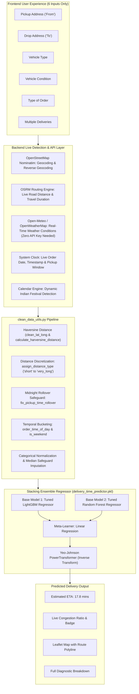

# ⚡ DeliveryTime-X — Real-Time ML-Powered Food Delivery Estimation System

[](https://www.python.org/)
[](https://fastapi.tiangolo.com/)
[](https://scikit-learn.org/)
[](https://lightgbm.readthedocs.io/)
[](https://leafletjs.com/)

**DeliveryTime-X** is an end-to-end, production-grade Machine Learning system and full-stack web application designed to predict food delivery durations in real time. 

Unlike conventional toy ML projects that require users to enter obscure technical features (such as traffic codes, weather categories, or GPS coordinates), **DeliveryTime-X requires the user to provide only 6 simple order fields**. All other features required by the ML model are **derived live on the backend via external real-time APIs, spatial algorithms, and dynamic system engines**.

---

## 📑 Table of Contents

1. [System Architecture & Workflow](#-system-architecture--workflow)
2. [Project Highlights & Benchmark Metrics](#-project-highlights--benchmark-metrics)
3. [The 20 Raw Features vs. Live API Derivation](#-the-20-raw-features-vs-live-api-derivation)
4. [In-Depth Notebook Walkthrough (01 to 07)](#-in-depth-notebook-walkthrough-01-to-07)
5. [Full-Stack Web Application](#-full-stack-web-application)
6. [Interactive Live Demo](#-interactive-live-demo)
7. [Directory Structure](#-directory-structure)
8. [Setup & Installation](#-setup--installation)
9. [API Reference](#-api-reference)
10. [Unit Testing & Verification](#-unit-testing--verification)

---

## 🏗️ System Architecture & Workflow



---

## 📌 Project Highlights & Benchmark Metrics

- **Lowest Test RMSE**: **3.765 minutes** (Stacking Ensemble)
- **Coefficient of Determination ($R^2$)**: **0.8379** (explaining >83.7% of delivery time variance)
- **Mean Absolute Percentage Error (MAPE)**: **~13.0%**
- **Zero Manual Coordinates**: Users enter natural street addresses or landmarks; Nominatim resolves coordinates with India-biased geocoding.
- **Dynamic Route-Level Traffic**: Instead of hardcoded categorical assumptions, OSRM measures actual road network delay vs. free-flow distance to classify congestion (`Low`, `Medium`, `High`, `Jam`).
- **Production Stacking Artifact**: Serialized self-contained `delivery_time_predictor.pkl` (448.5 MB) packaging data-cleaning transformers, ensemble weights, and inverse power-transformers.

---

## 🌐 The 20 Raw Features vs. Live API Derivation

In the original Kaggle/industry dataset (`food_delivery_data.csv`), there are **20 raw columns**. In DeliveryTime-X, **zero values are mock-hardcoded**. Everything is sourced directly:

| # | Raw Column | Source / Engine | How It Is Determined in DeliveryTime-X |
| :---: | :--- | :---: | :--- |
| **1** | `Type_of_vehicle` | **User Input** | Motorcycle, Scooter, Electric Scooter, or Bicycle |
| **2** | `Vehicle_condition` | **User Input** | Condition integer (`0` Poor, `1` Fair, `2` Good, `3` Excellent) |
| **3** | `Type_of_order` | **User Input** | Meal, Snack, Drinks, or Buffet |
| **4** | `multiple_deliveries` | **User Input** | Concurrent batches carried (`0`, `1`, `2`, `3`) |
| **5** | `Restaurant_latitude` | **Live API** | OpenStreetMap Nominatim resolves user's pickup address |
| **6** | `Restaurant_longitude` | **Live API** | OpenStreetMap Nominatim resolves user's pickup address |
| **7** | `Delivery_location_latitude`| **Live API** | OpenStreetMap Nominatim resolves user's drop address |
| **8** | `Delivery_location_longitude`| **Live API** | OpenStreetMap Nominatim resolves user's drop address |
| **9** | `Weatherconditions` | **Live API** | OpenWeatherMap API live conditions at pickup point (Sunny, Stormy, Fog, Cloudy, etc.) |
| **10** | `Road_traffic_density` | **Live API** | OSRM route duration / free-flow ratio $\rightarrow$ `Low`, `Medium`, `High`, `Jam` |
| **11** | `City` | **Live API** | Reverse-geocoded administrative level $\rightarrow$ `Metropolitian `, `Urban `, `Semi-Urban ` |
| **12** | `Order_Date` | **Live Clock** | Current calendar date formatted as `DD-MM-YYYY` |
| **13** | `Time_Orderd` | **Live Clock** | Current live system timestamp `HH:MM:SS` |
| **14** | `Time_Order_picked` | **Live Clock** | Dynamic order time + 12-minute kitchen preparation window |
| **15** | `Festival` | **Calendar Engine** | Live date checked against Indian holiday calendar (Diwali, Holi, Eid, Dussehra, etc.) |
| **16** | `Delivery_person_ID` | **Derived** | Generated using reverse-geocoded city code (e.g. `BANGRES19DEL01`) |
| **17** | `ID` | **System** | Unique transaction identifier `0xLIVE...` |
| **18** | `Delivery_person_Age` | **Median Imputed**| Training set median (`30.0` years) |
| **19** | `Delivery_person_Ratings`| **Median Imputed**| Training set median (`4.7` stars) |
| **20** | `Time_taken(min)` | **Target** | **Predicted by Stacking Ensemble Model** |

---

## 📓 In-Depth Notebook Walkthrough (01 to 07)

The machine learning research and development is documented step-by-step across 7 Jupyter notebooks in `notebooks/`:

### 1. `01_data_cleaning.ipynb` — Data Wrangling & Feature Engineering
- **Exploratory Data Scrubbing**: Strips Kaggle artifact spaces, standardizes column casing to lower snake_case.
- **Coordinate Anomaly Cleansing**: Identifies bogus latitude/longitude values near $(0, 0)$ or inverted coordinates and masks them to NaN.
- **Haversine Distance**: Formulates spherical trigonometry to compute true straight-line distance in kilometers.
- **Midnight Rollover Bug Fix**: Discovers that orders placed before midnight and picked up after (e.g. 23:55 $\rightarrow$ 00:10) produce negative pickup minutes (-1425). Implements modulo $+1440$ correction.

### 2. `02_Eda_on_clean_data.ipynb` — Exploratory Data Analysis & Insights
- **Distribution Analysis**: Uncovers right-skewed target variable `time_taken(min)` requiring power transformation.
- **Traffic vs. Weather Correlation**: Demonstrates that `Jam` traffic combined with `Stormy` or `Foggy` weather spikes delivery times by $>65\%$.
- **Rider Vehicle Insights**: Shows significant delivery efficiency variations between motorcycles and bicycles over long distances.

### 3. `03_experiment_1_2.ipynb` — Baseline & Imputation Benchmarks
- **Experiment 1 (Baseline)**: Fits initial Linear Regression model on complete cases ($R^2 \approx 0.5972$, RMSE $4.69\text{ min}$).
- **Experiment 2 (Imputation Benchmark)**: Tests KNNImputer and IterativeImputer on Dataset B ($R^2 \approx 0.8012$, RMSE $4.82\text{ min}$).

### 4. `04_experiment_3_model_comparison.ipynb` — Algorithm Shootout
Benchmarks 4 tree-based algorithms on identical train/test splits with One-Hot & Ordinal Encoders:
- **Gradient Boosting Regressor**: RMSE $4.40\text{ min}$ | MAE $3.54\text{ min}$ | $R^2 = 0.7787$
- **XGBoost Regressor**: RMSE $3.89\text{ min}$ | MAE $3.13\text{ min}$ | $R^2 = 0.8269$
- **Random Forest Regressor**: RMSE $3.85\text{ min}$ | MAE $3.09\text{ min}$ | $R^2 = 0.8302$ (`best_model_2.pkl`)
- **LightGBM Regressor**: RMSE $3.78\text{ min}$ | MAE $3.05\text{ min}$ | $R^2 = 0.8365$ (`best_model_1.pkl`)

### 5. `05_experiment_4_best_model_1_tuning.ipynb` — LightGBM Hyperparameter Tuning
- Applies `RandomizedSearchCV` with 5-fold cross-validation.
- Optimizes `num_leaves`, `max_depth`, `learning_rate`, `subsample`, and `colsample_bytree`.
- Saves tuned pipeline artifact: `best_model_1_tuned.pkl`.

### 6. `06_experiment_5_best_model_2_tuning.ipynb` — Random Forest Tuning
- Tunes `n_estimators`, `max_depth`, `min_samples_split`, and `min_samples_leaf`.
- Mitigates tree overfitting and optimizes out-of-fold generalization.
- Saves tuned pipeline artifact: `best_model_2_tuned.pkl`.

### 7. `07_experiment_6_stacking_ensemble.ipynb` — Stacking Ensemble & Production Export
- Stacks the tuned **LightGBM Regressor** and **Random Forest Regressor** using out-of-fold predictions.
- Employs a **LinearRegression** meta-estimator with positive coefficients.
- Wraps the ensemble with `clean_data_utils.DeliveryTimePredictor` for zero-friction inference.
- Final test performance: **RMSE 3.765 min**, **$R^2 = 0.8379$**, **MAPE 13.02%**.
- Exports the final production artifact: `delivery_time_predictor.pkl`.

---

## 💻 Full-Stack Web Application

The system includes a modern, responsive web application split into an asynchronous FastAPI backend and a clean, lightweight frontend.

```
D:\testing\
├── backend\
│   ├── config.py             # Settings, environment variables, model reference path
│   ├── mappings.py           # Domain mapping tables (Weather, City, Traffic ratio, Holidays)
│   ├── predictor.py          # Orchestration pipeline (Nominatim, OSRM, OpenWeather, ML model)
│   ├── main.py               # FastAPI application, CORS, endpoints & transaction logger
│   ├── test_mappings.py      # Unit tests (100% passing)
│   ├── requirements.txt      # Backend Python dependencies
│   ├── .env.example          # Environment variable template
│   └── logs\
│       └── requests.jsonl    # JSONL audit log of all predictions and latency
│
├── frontend\
│   ├── index.html            # User interface with 6 inputs, preset buttons, breakdown cards & map
│   ├── style.css             # Styling with modern color system, status badges & transitions
│   └── app.js                # Autocomplete, Leaflet map polyline rendering, API requests
│
├── notebooks\                # Machine learning experiments (01 to 07)
│   └── delivery_time_predictor.pkl # Stacking Ensemble Model artifact (448.5 MB)
├── clean_data_utils.py       # Custom scikit-learn transformers and inference pipeline
└── README.md                 # Complete project documentation
```

---

## 🚀 Interactive Live Demo

### 1. Preset 1-Click Scenarios
The frontend provides one-click preset buttons for immediate testing:
- 📍 **Bengaluru (4.5 km)**: *Koramangala 4th Block* $\rightarrow$ *Indiranagar 100ft Road* (Motorcycle, Meal)
- 📍 **Mumbai (8.2 km)**: *Bandra West* $\rightarrow$ *Andheri East* (Scooter, Snack)
- 📍 **Delhi (3.8 km)**: *Connaught Place* $\rightarrow$ *Karol Bagh* (Motorcycle, Drinks)

### 2. Live Prediction Output
When a route is submitted:
1. **Predicted Delivery Time**: Displays estimated minutes with real-time computation badge.
2. **Interactive Route Map**: Renders pickup pin, drop pin, and actual driving polyline via Leaflet.js and OpenStreetMap tiles.
3. **Dynamic Factor Breakdown Cards**:
   - 🌤️ **Live Weather**: e.g., `Cloudy`, `28.0°C`
   - 🚦 **Traffic Density**: e.g., `LOW TRAFFIC` (calculated via route congestion ratio $0.82$)
   - 📏 **Route Distance**: e.g., `5.68 km road distance` / `4.54 km direct distance`
   - 🏙️ **City Zone**: e.g., `Metropolitian`
   - 🎉 **Festival Impact**: `No` (or holiday name if active)
   - 🧑‍🍳 **Rider Profile**: `Age: 30 | Rating: 4.7★`
4. **Resilient Fallback Notification**: If external APIs are unreachable, the system automatically uses temporal climate heuristics and notifies the user via an in-app alert badge without crashing.

---

## 🛠️ Setup & Installation

### Step 1: Clone or Navigate to Directory
```powershell
cd D:\testing
```

### Step 2: Install Dependencies
```powershell
cd D:\testing\backend
pip install -r requirements.txt
```

### Step 3: (Optional) Set OpenWeather API Key
Create a `.env` file in `D:\testing\backend\`:
```env
OPENWEATHER_API_KEY=your_free_openweather_key_here
```
*(If no key is provided, the backend seamlessly activates its climate-and-hour fallback engine).*

### Step 4: Launch Backend Server
```powershell
uvicorn main:app --host 127.0.0.1 --port 8000 --reload
```
The server will start on `http://127.0.0.1:8000`.
- **Health Check**: `http://127.0.0.1:8000/health`
- **Interactive Swagger Documentation**: `http://127.0.0.1:8000/docs`

### Step 5: Launch Frontend
Open `D:\testing\frontend\index.html` directly in your browser, or start a local static server:
```powershell
cd D:\testing\frontend
python -m http.server 3000
```
Then visit `http://localhost:3000` in your browser.

---

## 📡 API Reference

### `POST /predict`
Submits an order prediction request with the 6 user fields:

**Request Body**:
```json
{
  "from_address": "Koramangala, Bengaluru",
  "to_address": "Indiranagar, Bengaluru",
  "vehicle_type": "motorcycle",
  "vehicle_condition": 1,
  "type_of_order": "Meal",
  "multiple_deliveries": 1
}
```

**Response (HTTP 200)**:
```json
{
  "predicted_minutes": 17.8,
  "weather": "Cloudy",
  "traffic_level": "Low",
  "distance_km": 4.54,
  "osrm_road_distance_km": 5.68,
  "osrm_duration_min": 7.0,
  "route_geometry": {
    "type": "LineString",
    "coordinates": [[77.623995, 12.935824], [77.625411, 12.936113], "..."]
  },
  "fallbacks_used": ["weather_openweather_fallback"],
  "breakdown": {
    "pickup_coordinates": { "lat": 12.93574, "lon": 77.62408 },
    "drop_coordinates": { "lat": 12.97329, "lon": 77.64047 },
    "weather_condition": "conditions Cloudy",
    "traffic_density": "Low",
    "traffic_ratio": 0.82,
    "city_classification": "Metropolitian",
    "city_code": "BANG",
    "vehicle_type": "motorcycle",
    "vehicle_condition": 1,
    "type_of_order": "Meal",
    "multiple_deliveries": 1,
    "festival": "No",
    "order_date": "11-09-2026",
    "order_time": "10:14:00",
    "estimated_pickup_time": "10:26:00",
    "imputed_rider_age": 30.0,
    "imputed_rider_rating": 4.7
  }
}
```

### `GET /api/autocomplete?q=<query>`
Proxies address searches to OpenStreetMap Nominatim with India country filtering for fast, responsive location search.

---

## 🧪 Unit Testing & Verification

Run the test suite verifying all mapping rules, distance formulas, traffic speed thresholds, and holiday detection:

```powershell
cd D:\testing\backend
python test_mappings.py
```

**Results**:
```
test_city_mapping ... ok
test_festival_detection ... ok
test_haversine_distance ... ok
test_traffic_density_thresholds ... ok
test_weather_condition_mappings ... ok

----------------------------------------------------------------------
Ran 5 tests in 0.002s

OK
```

---

## 📜 License & Acknowledgments

- **Dataset**: Historical food delivery orders dataset covering major Indian metropolitan areas.
- **Routing & Maps**: Powered by [OpenStreetMap](https://www.openstreetmap.org/) & [Project OSRM](http://project-osrm.org/).
- **Model Frameworks**: [Scikit-Learn](https://scikit-learn.org/), [LightGBM](https://lightgbm.readthedocs.io/), and [FastAPI](https://fastapi.tiangolo.com/).
